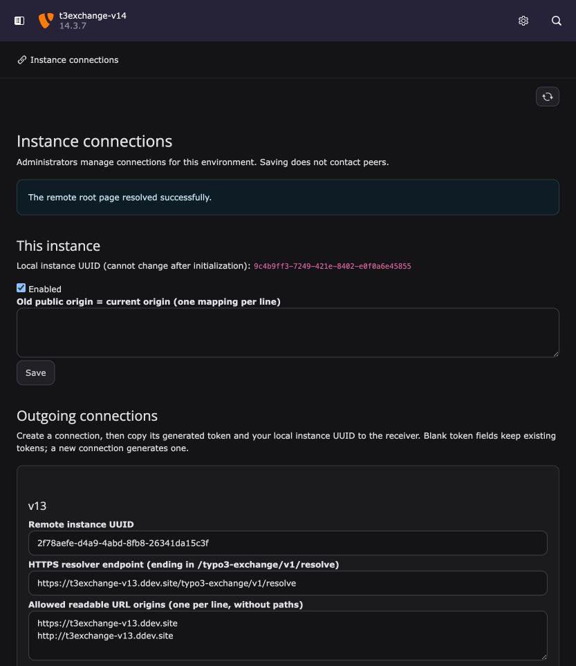
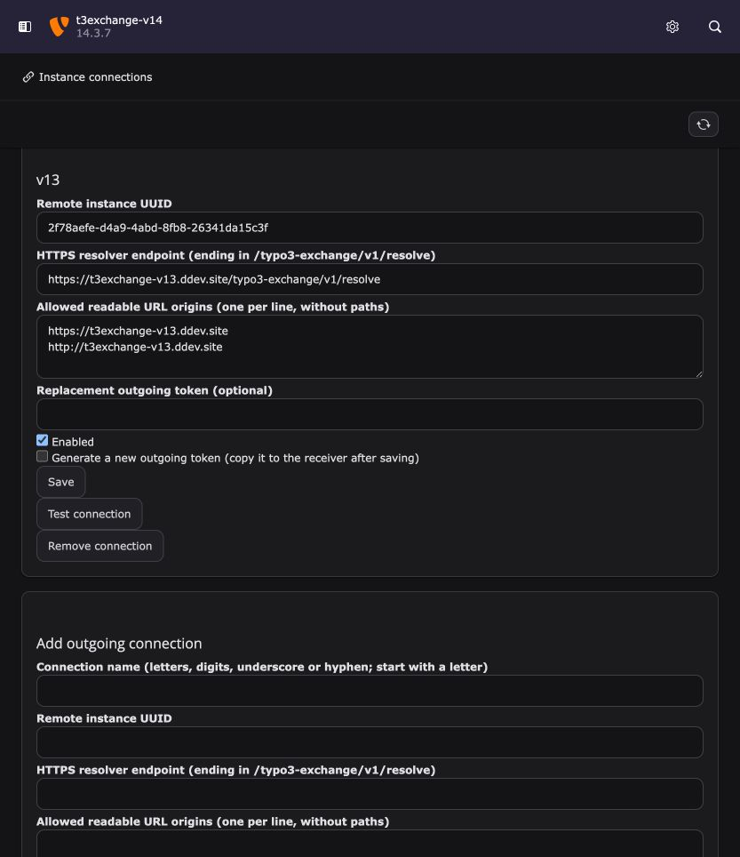
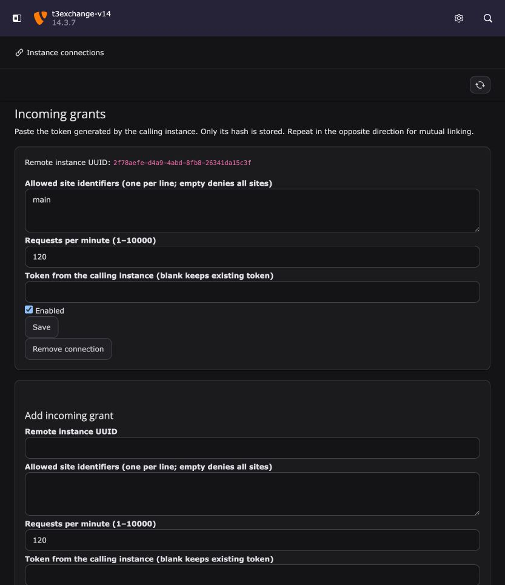

# Backend connection management

Open **System → Instance connections** as a TYPO3 administrator. This module is
available on TYPO3 13 and 14. It manages local identity, outgoing connections,
incoming grants and public-origin aliases. Editors cannot access it or invoke
its actions directly. All writes and connection tests require a valid form token.

For the **Usage and notifications** configuration, including environment
initialization and capability-form screenshots, see
[report usage and notify consumers](usage-notifications.md).

*TYPO3 14.3.7 development instance, English interface in dark mode. The connection
test shown above successfully resolved the TYPO3 13 root page.*

## Existing installations

Deploy the extension, run `vendor/bin/typo3 extension:setup`, and flush caches.
Open the module and select **Import existing configuration** before initializing
anything new. It reads the configured `TYPO3_EXCHANGE_CONFIG` file once, preserving
instance UUIDs, tokens, grants and aliases. Import refuses to overwrite an
initialized configuration. After confirming both directions work, remove the
legacy file and its environment variable from the deployment's secret management.
Keep the file protected until then; it still contains old plaintext credentials.

The database configuration takes precedence after import. Legacy JSON remains a
compatibility source only while the connection table is empty. A cloned database
containing configuration for another key/context stays disabled, even if a legacy
file is present. The legacy file is never editable through the module.

## Pair two instances

1. On a new installation, save the local instance identity and enable connections.
   Keep the generated UUID stable. Existing installations should import instead.
2. On A, add an **Outgoing connection** to B. Enter B's local UUID, its HTTPS
   resolver endpoint (`https://b.example/typo3-exchange/v1/resolve`), and permitted
   readable URL origins, one per line. Leave the token blank to generate one.
3. Copy the generated token immediately. It appears only in the save response.
4. On B, add an **Incoming grant** using A's local UUID and that token. Enter the
   permitted TYPO3 site identifiers and the request limit. Enable the grant.
5. On A, use **Test connection**. It resolves the root URL of the first configured
   origin; that root must be published and covered by the receiving site grant.
6. For links in the opposite direction, repeat with a new outgoing connection on
   B and an incoming grant on A. Use an independent token for each direction.

*Outgoing connection from TYPO3 14 to TYPO3 13. The stored token is not displayed;
the replacement field is intentionally empty.*

*Incoming grant for the TYPO3 13 caller, limited to site `main` and 120 requests
per minute. No saved token or token hash is exposed.*

Saved tokens and incoming hashes never appear in subsequent forms. Empty token
fields preserve saved credentials. **Generate a new outgoing token** rotates the
sender's token; copy it to the receiving grant before testing again. Communication
may be denied between those two changes. If the one-time display is lost, generate
another token. A pasted replacement must contain 64 lowercase hexadecimal
characters. The module never displays raw transport errors or credentials.

Saving and browsing never call peers. **Test connection** is an explicit network
action with the existing fixed-endpoint, origin, TLS, response-size and timeout
checks. A failed root-page test can mean the root is unavailable or outside the
grant, not necessarily invalid credentials. Pending conversions and paused
refreshes retain the [normal repair workflow](operations.md#diagnose-and-recover).

## Encryption and environment isolation

No extra key file is needed. The extension derives its authenticated-encryption
key from TYPO3's `SYS.encryptionKey` plus the exact application context. The
configuration is stored as one encrypted, revisioned database record per key and
context. This keeps outgoing secrets out of ordinary record forms, search and
DataHandler history. Concurrent stale saves are rejected; reload before editing.
Configuration saves flush TYPO3 page caches so connection changes take effect.

A database-only production clone into an installation with a different TYPO3 key
or application context cannot decrypt or activate copied connections. Initialize
or explicitly import the intended environment's connections in its backend. No
production connection is automatically copied into the new environment.

A **full server/configuration clone with the same key and context can decrypt the
connections**. Before starting it, isolate outbound traffic and change its context
or provision a distinct TYPO3 key, then configure the intended peers. Keep TYPO3's
settings and encryption key out of database exports and source control.

Changing TYPO3's encryption key or application context makes existing connection
records inaccessible. Back up the original key securely. Restore it to recover
existing configuration, or initialize connections under the new key/context and
rotate/re-pair tokens. Preserve the logical instance UUID when rebuilding the
same instance's configuration; changing that identity breaks existing references.
This feature does not perform automatic re-encryption during key rotation.

The extension requires PHP sodium. Back up the database and TYPO3 configuration
securely; possession of both can expose credentials. Use distinct keys/contexts
for Development, Testing and production.

## Tests

`Tests/Functional/ConnectionsTest.php` covers admin authorization, CSRF, validation,
one-time tokens, incoming hashing, encryption, corrupted ciphertext, stale writes,
imports, and key/context clone isolation. `Tests/Integration/ConnectionsTest.php`
verifies that real HTTPS requests use the database configuration, and that grant
revocation and restoration apply immediately. These tests use only isolated
Testing databases; see [running the suites](testing.md).
