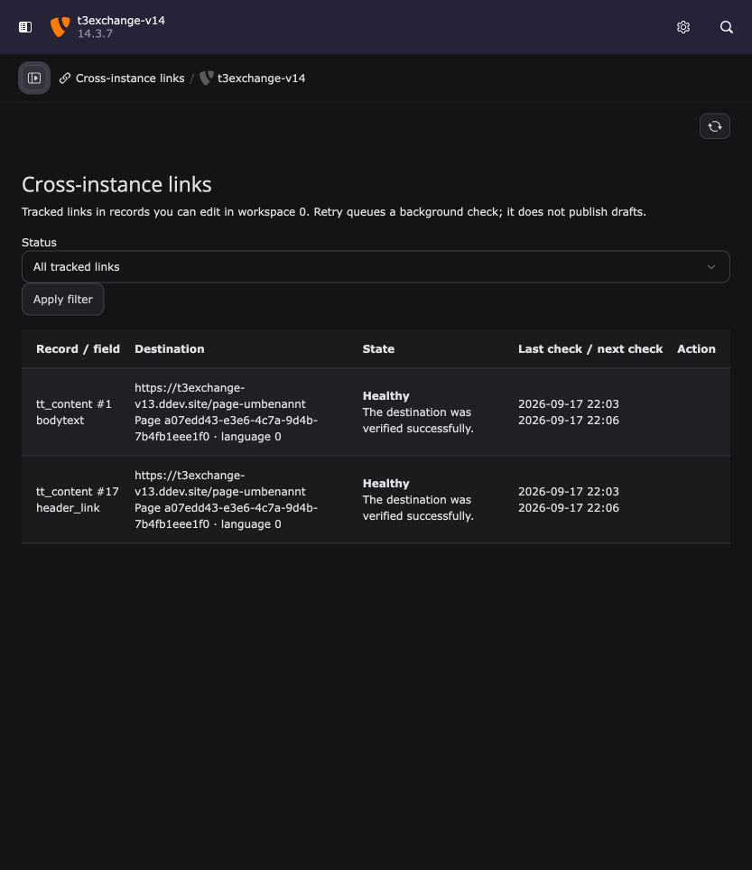

# TYPO3 to TYPO3

Maintainable page links between TYPO3 instances, with secure peer connections
managed in the TYPO3 backend.

Paste a readable URL from another instance into a link field or rich-text editor.
The extension resolves it to a stable page reference and renders the destination's
verified URL. Background jobs retry delayed lookups and refresh destinations
after page renames, moves, or configured domain changes.

## Beta status

The extension is ready for beta testing on TYPO3 13.4 and 14.3 with PHP 8.2 or
newer. Start with staging sites or disposable installations. Production scheduling,
external-cache integration, and the ten-peer/10,000-reference throughput target
still require deployment-specific validation.

## Get started

1. Follow the [repository's local development setup](https://github.com/42lizard/typo3totypo3#local-development)
   to run both TYPO3 versions with DDEV.
2. [Connect the instances](connections.md) using generated directional tokens
   and site-scoped grants.
3. [Create cross-instance links](link-fields.md) in link fields and rich text.
4. [Schedule retry and refresh jobs](operations.md) and use the
   [link overview](backend-report.md) to check destinations.

## Help improve the beta

Run the [PHPUnit suites](testing.md) and report reproducible bugs in
[GitHub Issues](https://github.com/42lizard/typo3totypo3/issues). Include TYPO3/PHP
versions, reproduction steps, and expected versus actual behavior. Remove
credentials, tokens, encryption keys, and private content from reports.

The extension is licensed under
[GPL-2.0-or-later](https://github.com/42lizard/typo3totypo3/blob/main/LICENSE).
